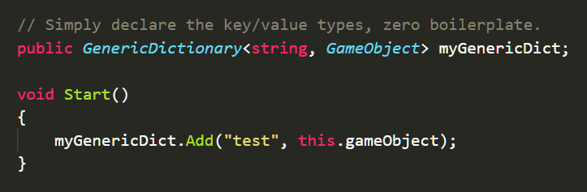

# Generic Serializable Dictionary
Minimalist dictionary for Unity 2020.1.x with a native look and feel.

## What

* Generic and serializable Dictionary for Unity in about 70 LOC (including summaries and comments).

* Uses plain System.Collections.Generic objects in combination with Unitys built-in serializer.

* Optional property drawer that displays the Dictionary near pixel perfectly as a List but with standard spacing between each KeyValue-pair (to make it easier on the eyes).

* Zero boilerplate, declare your field and start using it! See Example.cs for specifics.

## Why 

As of 2020.1.x Unity supports generic serialization and native support for displaying generic Lists in the inspector. But for a long time the community has wanted a generic Dictionary implementation that doesn't require you to add boilerplate for each concrete Dictionary type.

Also, personally I'm not a fan of heavily decorated or bloated inspectors that deviate from Unity's standard inspector look and feel. This dictionary aims to look and work like the standard components you already know and use.

## How

The GenericDictionary class contains all the interesting bits. It implements the IDictionary interface to behave as a standard generic dictionary and can be passed around as both an ICollection and IDictionary implementation. But it also implements ISerializationCallback to receive serialization callbacks. Upon (de)serialization it syncs the backing Dictionary with the frontend List. If there are any key collisions there's a GenericDictionaryPropertyDrawer that displays a standard Unity helpbox in the inspector to highlight this.

So no datastructures were harmed or modified when creating this: it's all just plain old System.Collections.Generic but used together with Unitys generic serializer to display a native feeling Dictionary in the inspector.

## Features

* Looks and feels like a native inspector, renders much like a List<T> (with some enhancements to visability/useability).

* Runtime additions to the Dictionary immediately renders in the inspector (see Example.cs).

* Works regardless of context, use in MonoBehaviours and the runtime additions are cleared from the dictionary - or use in ScriptableObjects and the runtime additions remain serialized - just as expected.

* The custom property drawer displays a standard warning box for key collisions - similar to the floating point precision warning in the Transform component.

![]propertydrawerexample.PNG

## How to use

This repo is a regular Unity project, so you have two choices:
* Clone the repo and open the project in Unity and give it a spin.
* Copy GenericDictionary.cs into your Asset folder and the GenericDictionaryPropertyDrawer.cs into an Editor folder and you're good to go.

## Requirements

A Unity version with support for generic serialization (currently 2020.1.x and above).

## License
Licensed under MIT, see license file.
