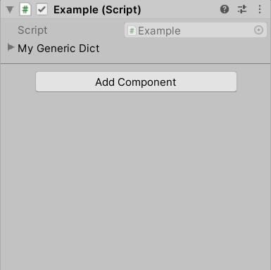
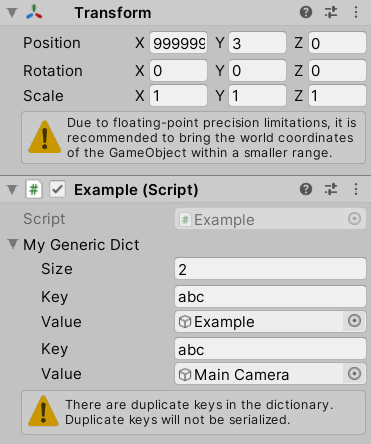

# Generic Serializable Dictionary
Lightweight and minimalist dictionary for Unity 2020.1.x with a native look and feel.

## What
* Uses plain System.Collections.Generic objects in combination with Unity's generic serializer.

* Implements the IDictionary interface and can also be passed around as an ICollection.

* Optional property drawer that displays the Dictionary near pixel perfectly as a List but with standard spacing between each KeyValue-pair (to make it easier on the eyes).

  

* Zero boilerplate, declare your field and start using it! See Example.cs for specifics.
  
  ```csharp
  // Simply declare the key/value types, zero boilerplate.
  public GenericDictionary<string, GameObject> myGenericDict;

  void Start()
  {
      myGenericDict.Add("test", this.gameObject);
  }
  ```

## Why 

As of 2020.1.0a Unity supports generic serialization and native support for displaying generic Lists in the inspector. But for a long time the community has wanted a generic Dictionary implementation that doesn't require you to add boilerplate for each concrete Dictionary type.

Also, personally I'm not a fan of heavily decorated or bloated inspectors that deviate from Unity's standard inspector look and feel. This dictionary aims to look and work like the standard components you already know and use.

## How

The GenericDictionary class contains all the interesting bits. It implements the IDictionary interface to behave as a standard generic dictionary. But it also implements ISerializationCallback to receive serialization callbacks - upon (de)serialization it syncs the backend Dictionary with the frontend List. If there are any key collisions the property drawer displays a standard helpbox to highlight this.

No datastructures were harmed or modified when creating this: it's all just plain old System.Collections.Generic but used behind a IDictionary interface used together with Unitys generic serializer to display a native feeling Dictionary in the inspector.

## Features

* Native look and feel, renders much like a List<T> (with some enhancements to visability/useability).

* Runtime additions to the Dictionary immediately show up in the inspector (see Example.cs).

* Works regardless of context, use in MonoBehaviours and the runtime additions are cleared from the dictionary - or use in ScriptableObjects and the runtime additions remain serialized - just as expected.

* The custom property drawer displays a standard warning box for key collisions - similar to the floating point precision warning in the Transform component.

  

## How to use

This repo is a UPM package by itself, so you can use Unity Package Manager

* Press the plus sign and choose `Add package from git URL...`. There, use `https://github.com/upscalebaby/generic-serializable-dictionary.git`, or, with version: `https://github.com/upscalebaby/generic-serializable-dictionary#1.0.2`
* You can also clone this repository and then add it as a local package using `Add package from disk...` option.
* Another option is to manually edit the manifest.json file in your Packages folder. Add  `"com.upscalebaby.generic-serializable-dictionary" : "https://github.com/upscalebaby/generic-serializable-dictionary"`, or, with version:  `"com.upscalebaby.generic-serializable-dictionary" : "https://github.com/upscalebaby/generic-serializable-dictionary#1.0.2"`
* Alternatively, you can copy the GenericDictionary.cs into your Assets folder and the GenericDictionaryPropertyDrawer.cs into an Editor folder and you're good to go.

Examples can be installed from the package via Unity Package Manager.

## Requirements

A Unity version with support for generic serialization (currently 2020.1.x and above).

## License
Licensed under MIT, see [license file](License.md).